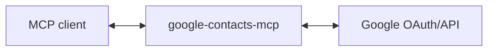

# google-contacts-mcp

MCP server for Google Contacts - list, search, and manage contacts.

## Use Cases

**Email lookup**: "See the latest JIRA ticket that's come in. Can we email Sarah from the security team to get their input?" → finds Sarah's email and drafts the message.

**Business card capture**: After a networking event, snap photos of business cards → your assistant extracts the details and adds them as contacts with a note about where you met.

**Find connections**: "Who do I know at Google?" or "I'm visiting London next week - who should I catch up with?" → search your personal network.

**Call reminder**: "Remind me to call Mike at 3pm" → creates a calendar event with Mike's phone number attached so you can dial straight from the reminder.

**Contact updates**: You receive an out-of-office saying someone left their company with a new personal email → your assistant updates their contact automatically.

(These are just examples - any workflow that needs contact lookup or management can use this.)

## Setup

### 1. Create Google OAuth credentials

1. Go to [Google Cloud Console](https://console.cloud.google.com/)
2. Create a new project (or use existing)
3. Enable the People API
4. Go to **APIs & Services** → **OAuth consent screen**, set up consent screen
5. Go to **APIs & Services** → **Credentials** → **Create Credentials** → **OAuth client ID**
6. Choose **Web application**
7. Add `http://localhost:3000/callback` to **Authorized redirect URIs**
8. Note your Client ID and Client Secret

### 2. Run the server

```bash
GOOGLE_CLIENT_ID='your-client-id' \
GOOGLE_CLIENT_SECRET='your-client-secret' \
MCP_TRANSPORT=http \
npm start
```

The server runs on `http://localhost:3000` by default. Change with `PORT=3001`.

### 3. Add to your MCP client

With the server running, follow the instructions on [install-mcp](https://adamjones.me/install-mcp/?url=http://localhost:3000/mcp), which generates the right config for your MCP client (Claude Code, Claude Desktop, Cursor, Cline, VS Code, and more).

## Architecture

This server acts as an **OAuth proxy** to Google:



1. Server advertises itself as an OAuth authorization server via `/.well-known/oauth-authorization-server`
2. `/register` returns the Google OAuth client credentials
3. `/authorize` redirects to Google, encoding the client's callback URL in state
4. `/callback` receives the code from Google and forwards to the client's callback
5. `/token` proxies token requests to Google, injecting client credentials
6. `/mcp` handles MCP requests, using the bearer token to call People API

The server holds no tokens or state - it just proxies OAuth to Google.

## Tools

| Tool | Description |
|------|-------------|
| `contacts_list` | List contacts with names, emails, phones, organizations, birthdays, events, URLs, addresses, nicknames, relations, IM usernames, and custom fields |
| `contacts_search` | Search contacts by name, email, or phone |
| `directory_search` | Search organization directory for coworkers |
| `contact_get` | Get detailed info for a single contact |
| `contact_create` | Create a new contact |
| `contact_update` | Update an existing contact |
| `contact_delete` | Permanently delete a contact |
| `contact_photo_update` | Set or replace a contact's photo |
| `contact_photo_delete` | Remove a contact's photo |
| `contact_groups_list` | List contact groups (labels) |
| `contact_group_get` | Get a contact group, including its members |
| `contact_group_create` | Create a new contact group |
| `contact_group_update` | Rename a contact group |
| `contact_group_delete` | Permanently delete a contact group |
| `contact_group_members_modify` | Add or remove contacts from a contact group |

## Contributing

Pull requests are welcomed on GitHub! To get started:

1. Install Git and Node.js
2. Clone the repository
3. Install dependencies with `npm install`
4. Run `npm run test` to run tests
5. Build with `npm run build`

## Releases

Versions follow the [semantic versioning spec](https://semver.org/).

To release:

1. Use `npm version <major | minor | patch>` to bump the version
2. Run `git push --follow-tags` to push with tags
3. Wait for GitHub Actions to publish to the NPM registry.
